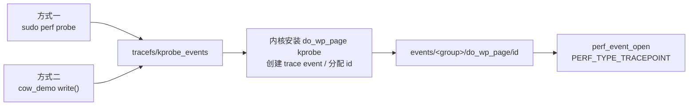

# COW `do_wp_page` 观测 Demo

父进程申请并写入私有匿名内存，`fork()` 后子进程逐页写入，触发
`do_wp_page()` 完成 Copy-On-Write。程序提供两个 watcher：

- 方式一：`perf probe` + `perf record`；
- 方式二：C 代码通过 tracefs 注册 kprobe，再用 `perf_event_open()` 订阅动态事件。

两种方式只采集子进程用户态调用栈。方式二只接受真正的 `do_wp_page` 事件，
**不再回退到 `PERF_COUNT_SW_PAGE_FAULTS`**；任何失败都会记录原因并退出。

## 构建和检查

```bash
make
./setup.sh
./setup.sh --fix    # 只尝试安装 perf / 挂载 tracefs，不修改 sudoers 或 ACL
```

## 命令行

```bash
./cow_demo --watch method1 --size 16
sudo ./cow_demo --watch method2 --size 16
sudo ./cow_demo --watch both --size 16
```

不设置 `--watch` 时默认 `both`。

```text
--watch W        method1|method2|both（默认 both）
--size M         内存大小，单位 MiB（默认 16）
--script PATH    方式一脚本（默认 scripts/perf_cow_watch.sh）
--warmup MS      等待 perf attach 的时间（默认 500ms）
--max-print N    方式二最多打印的样本数（默认 3）
--max-frames N   每条用户态调用栈最多打印的帧数（默认 24）
--verbose        成功时也打印方式一记录日志
--help           帮助
```

`--backend` 已移除，因为方式二不再提供 page-fault fallback。

## 权限执行模型

### 方式一：`cow_demo` 非 root，`perf` 使用 sudo

推荐：

```bash
sudo -v
./cow_demo --watch method1
```

当 `cow_demo` 由非 root 用户启动时，`scripts/perf_cow_watch.sh` 固定使用：

```bash
sudo -n perf probe --add do_wp_page
sudo -n perf record --user-callchains -e probe:do_wp_page -g -p <child-pid>
sudo -n perf script ...
sudo -n perf report ...
```

`-n` 禁止 sudo 交互式询问密码，避免后台记录进程在不可见的密码提示上永久卡住。
执行者应先运行 `sudo -v` 缓存凭据，并确保 sudoers 允许 perf、sudo 的
`secure_path` 能找到与当前内核匹配的 perf。

如果整个程序已经通过 `sudo ./cow_demo` 启动，脚本检测到 uid 0 后会直接执行
`perf`，不会再套一层 sudo。

方式一需要：

1. 安装与当前内核匹配的 perf；
2. sudoers 允许当前用户执行 perf；
3. tracefs 已挂载，内核启用了 kprobe/ftrace；
4. `do_wp_page` 可探测。

记录阶段的全部 stdout/stderr 写入 `<outdir>/record.log`。以下情况都会回放日志并
让 `cow_demo` 以非零状态退出：

- `sudo -n perf` 不可用；
- `perf probe` 注册失败；
- `perf record` 无法 attach；
- 记录进程退出或未生成 `perf.data`；
- `perf script/report` 分析失败。

### 方式二：不自动 sudo，由执行者决定

方式二始终执行以下真实 kprobe 路径：

```text
write <tracefs>/kprobe_events:
    p:cowdemo/do_wp_page do_wp_page
read <tracefs>/events/cowdemo/do_wp_page/id
perf_event_open(PERF_TYPE_TRACEPOINT, config=id, pid=child)
```

程序内部不会调用 sudo。推荐直接：

```bash
sudo ./cow_demo --watch method2
```

或者由管理员为非 root 配置全部必要条件：

1. 对 tracefs 根目录和 `events` 目录的遍历权限；
2. 对 `kprobe_events` 的读写权限；
3. 对动态事件 `id` 的读取权限；
4. `perf_event_paranoid=-1`，或给 `cow_demo` `CAP_PERFMON`。

缺少任一条件时，方式二不会使用 page-fault 替代，而是：

1. 打印失败阶段、uid/euid、`perf_event_paranoid`、tracefs 路径和 errno；
2. 把同样信息写入 `/tmp/cow_demo_method2_<child-pid>.log`；
3. 清理已经注册的 kprobe；
4. 以非零状态退出。

是否执行 `sudo ./cow_demo` 完全由执行者决定。

## 默认 `both`

默认同时启动两个 watcher：

```bash
sudo ./cow_demo
```

推荐对 `both` 使用 sudo，因为方式二不会自行提权。此时方式一发现当前已经是 root，
直接运行 perf；方式二也以 root 注册 kprobe 和调用 `perf_event_open()`。

流程：

1. 父进程申请并预写内存；
2. `fork()` 子进程，子进程等待；
3. 方式一启动 perf recorder；
4. 方式二注册 `cowdemo/do_wp_page` 并打开 perf event；
5. watcher 启动完成后放行子进程逐页写入；
6. 子进程写完但仍存活时停止两个 watcher；
7. 允许子进程退出并输出调用栈、COW 汇总。

任一 watcher 失败时不会冒充成功或改用其他事件源；可用 watcher 可以完成收尾，但
最终退出码为非零。

## 为什么方式二必须注册动态事件

`do_wp_page` 是普通内核函数，不是预置 perf 事件。程序必须先向
`kprobe_events` 写入探针定义，让内核安装 kprobe、创建 trace event 并动态分配 id，
再把 id 作为 `perf_event_attr.config` 传给 `perf_event_open()`。

方式一的 `perf probe --add do_wp_page` 原理完全相同：perf 也会写 tracefs 的
`kprobe_events`；`perf record -e probe:do_wp_page` 再读取动态 id。



## 输出与统计

子进程用户态调用链类似：

```text
cow_touch_pages → child_main → main → __libc_start_main → _start
```

在受控场景中，每次 `do_wp_page` 对应一页真实 COW：

```text
COW 内存 = do_wp_page 事件数 × 页面大小
```

程序使用 `MADV_NOHUGEPAGE` 避免透明大页影响基页统计。

## 常见故障

### 方式一：`sudo -n perf` 不可用

```bash
sudo -v
sudo -n perf --version
```

若仍失败，检查 sudoers 的命令规则和 `secure_path`。

### 方式一：没有 `perf.data`

查看程序自动回放的 `<outdir>/record.log`。常见原因是 perf 与内核版本不匹配、
tracefs 不存在、`do_wp_page` 不可探测或 perf record attach 失败。

### 方式二：未找到 tracefs

说明内核未启用 tracefs/kprobe，或容器未暴露宿主 tracefs。sudo 只能解决权限，
不能让一个未编译的内核功能出现。

### 方式二：Permission denied

直接使用：

```bash
sudo ./cow_demo --watch method2
```

若 sudo 后仍失败，检查内核 lockdown、容器 capability/seccomp、kprobe 黑名单以及
内核配置。
